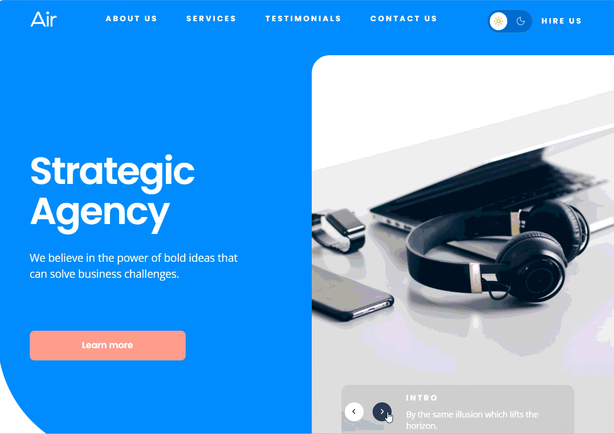
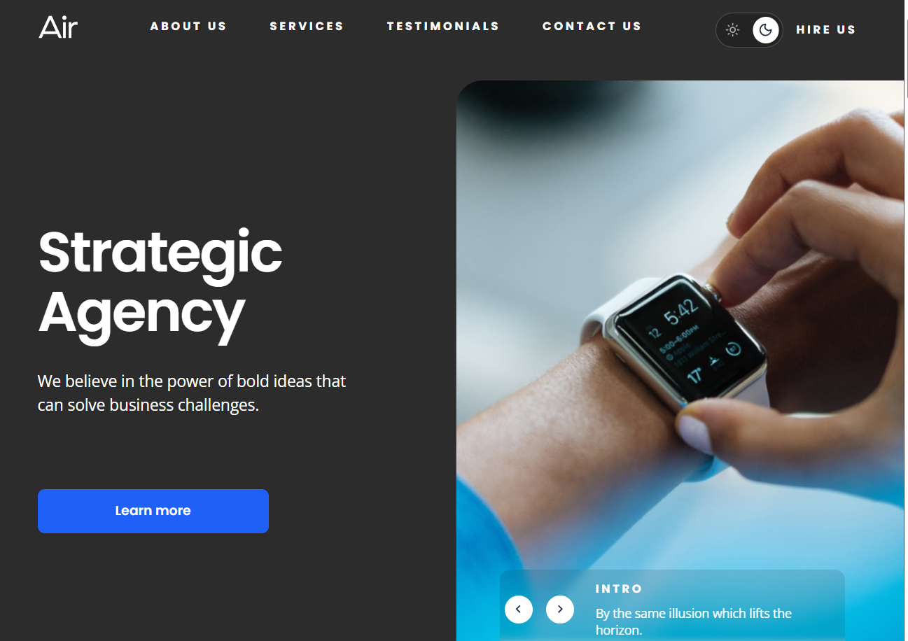
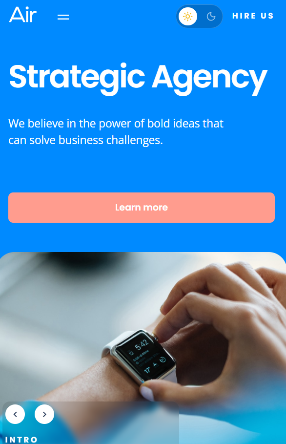

# 🌀 Air — Strategic Agency

A responsive landing page for a creative strategy agency, featuring an infinite image slider and a light/dark theme switcher — built with **HTML5**, **SCSS**, and **vanilla JavaScript**.

🔗 **[View live demo](https://yuliia-nudyk.github.io/air-strategic-agency/)**







## 📝 Description

Air is a landing page for a fictional creative strategy agency, presenting its services, expertise, and client testimonials. The page features a true infinite image slider in the hero section, a light/dark theme toggle that persists across visits, a mobile navigation menu, and a contact form. The layout is built mobile-first, with styles progressively layered on for tablet, small desktop, and large desktop breakpoints via a shared set of SCSS mixins.

### Features

- Infinite, seamless image slider with no visible "jump" when looping
- Light/dark theme switcher with an animated toggle, persisted via `localStorage`
- Mobile navigation menu with a dedicated open/close state
- Service and expertise sections laid out with a responsive grid system
- Testimonials section with accent color variants per review
- Contact form with client-side validation and reset on submit
- Fully responsive layout across mobile, tablet, small desktop, and large desktop breakpoints

- HTML5 (semantic markup, BEM naming)
- SCSS (Sass) — partials architecture with variables, mixins, and placeholders
- JavaScript (Vanilla JS, ES6+)
- Vite — build tool

## 💡 Technical highlights

- **True infinite slider** — implemented by cloning the first and last slides at each end of the track, then silently "jumping" back to the real slide (with transitions disabled for one frame via a double `requestAnimationFrame`) once the clone finishes sliding into view, so the loop feels seamless in both directions.
- **Theme switcher built on a single source of truth** — a `dark` class on `<html>` drives every themed style, with its position and colors calculated from shared SCSS variables (icon size + gap) rather than hand-picked pixel values, keeping the toggle animation and layout in sync automatically.
- **Responsive, offset card grid** — every second service card is vertically offset using a proportional `transform: translateY()`, so the effect scales naturally with content length instead of relying on a fixed card height.
- **Full-bleed layout elements inside a centered container** — sections that need to break out of the page's centered max-width (e.g. the hero slider) use `calc()`-based positioning anchored to the viewport, so they always reach the screen edge regardless of how wide the window gets.
- **Accessible icon-only controls** — all icon buttons and social links use `aria-label` with `aria-hidden` decorative SVGs, and external links are secured with `rel="noopener noreferrer"`.

1. Clone the repository:

```bash
   git clone https://github.com/yuliia-nudyk/air-strategic-agency.git
```

2. Navigate to the project folder:

```bash
   cd air-strategic-agency
```

3. Install dependencies:

```bash
   npm install
```

4. Run the project locally:

```bash
   npm start
```

This will launch the project via Vite, which automatically compiles SCSS to CSS and serves the app with hot reload.

## 📂 Project structure

```
├── src/
│   ├── fonts/
│   ├── images/
│   ├── scripts/
│   │   └── main.js
│   └── styles/
│       ├── blocks/
│       │   └── ...
│       ├── _extends.scss
│       ├── _mixins.scss
│       ├── _themes.scss
│       ├── _typography.scss
│       ├── _variables.scss
│       ├── main.scss
│       └── reset.scss
├── index.html
└── README.md
```
